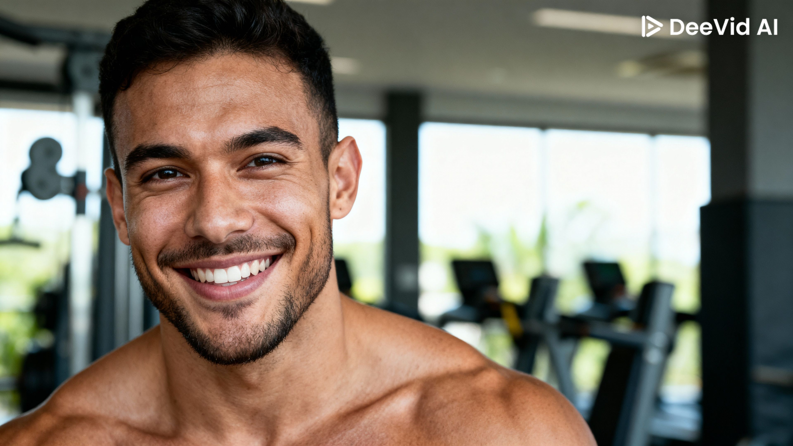

# 🏋️ A Força do Natty na Era da IA: Uma Imagem Hiper-realista

## 📒 Descrição
Este projeto explorou a capacidade da Inteligência Artificial Generativa de criar uma imagem fotorrealista de um atleta "natural" (natty), desafiando a percepção humana sobre o que é real na internet.

## 🤖 Tecnologias Utilizadas
* **IA de Geração de Imagem:** DeeVid AI

## 🧐 Processo de Criação

1.  **Conceito Inicial:** O objetivo era criar um retrato de rosto para simular uma foto de perfil de mídia social, focado em detalhes da pele e iluminação.
2.  **Prompt Principal:** Usei o seguinte prompt principal:
    > **Prompt 1:** Um retrato de close-up de um fisiculturista 'natty' sorrindo, na academia, luz natural, foto de alta resolução, 8k, pele detalhada.
3.  **Seleção Final:** A imagem escolhida foi a que melhor representou a estética "natty"!

## 🚀 Resultados

## 💭 Reflexão (Opcional)
[Foi surpreendentemente difícil instruir a IA a não exagerar na definição muscular, pois a tendência da ferramenta era gerar um padrão estético "não natural". Isso mostra como as IAs ainda carregam um viés estético que precisa ser corrigido com prompts específicos, provando a complexidade de criar algo verdadeiramente "natty" com IA.]
